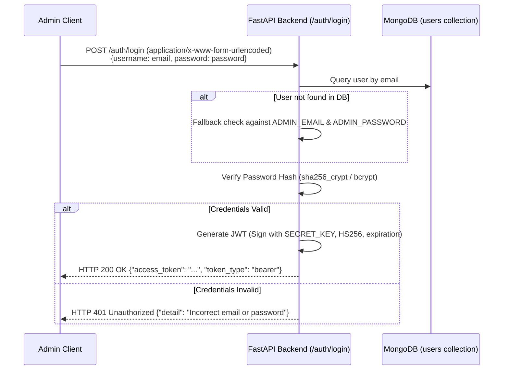

# Face Recognition Attendance System - Backend Engine

The backend engine is a high-performance, real-time facial recognition attendance system built using **FastAPI (Python)** and **MongoDB**. It integrates face detection, embedding extraction, and multi-face similarity comparison over WebSocket and REST endpoints with strict multi-class isolation.

---

## 1. Project Architecture, Working Models & Core Algorithms

The backend leverages a decoupled, pipeline-based model for face identification and database persistence.

```mermaid
graph TD
    Client[Client Browser / Webcam] -->|1. Base64 Frames via WS| WS[FastAPI WebSocket /ws/camera/{session_id}]
    WS -->|2. Frame Decoding| Dec[Base64 Decode & CV2 Convert]
    Dec -->|3. Multi-Face Detection| MTCNN[MTCNN Face Detector]
    MTCNN -->|Bounding Boxes & Crops| Embed[InsightFace buffalo_l App]
    Embed -->|4. Generate Embeddings| Spatial[512-Dim Feature Vectors]
    Spatial -->|5. Proximity Comparison| Match[Cosine Similarity Engine]
    Match -->|6. Query Filter by Class| DB_Query[MongoDB Collection Query]
    DB_Query -->|7. Identity Resolved| Check[Threshold Verification >= 0.6]
    Check -->|8. Mark Present| DB_Log[MongoDB attendance-{class_name}]
    DB_Log -->|9. WebSocket Push| Client
```

### 1.1 Face Detection & Alignment Model
- **Model**: **MTCNN (Multi-task Cascaded Convolutional Networks)**
- **Function**: Extracts bounding boxes (`[x, y, x2, y2]`) and landmarks for all faces present in the frame.
- **Pipeline Implementation**: `app/services/face_detector.py` defines `detect_faces` which decodes and converts raw images, runs MTCNN cascaded networks, and crops positive face regions for downstream feature extraction.
- **Pre-processing & Performance Optimizations**:
  - **Frame Throttling**: Limits frame processing to a maximum frequency of ~6.6 FPS (minimum `0.15s` interval) to avoid high CPU usage.
  - **Blur Detection**: Calculates Laplacian variance on grayscale frames; discards frames with a variance below `85.0` to filter out motion blur or out-of-focus images.
  - **Low-Light Enhancement**: Automatically triggers when mean pixel intensity drops below `80.0`. It converts the frame to the LAB color space, applies **CLAHE (Contrast Limited Adaptive Histogram Equalization)** to the L-channel (clip limit: `3.0`, grid size: `8x8`), and converts it back to RGB for improved detector sensitivity.

### 1.2 Feature Extraction (Face Embeddings)
- **Model Framework**: **InsightFace (`buffalo_l` model pack)**
- **Execution Provider**: `CPUExecutionProvider` configured through ONNX Runtime.
- **Output**: 512-dimension floating-point spatial vector representing facial attributes.
- **Implementation**: `app/services/face_embedder.py` converts RGB matrices to BGR, registers them with `FaceAnalysis`, and returns 512-dimensional arrays.

### 1.3 Face Verification & Matching Algorithm
- **Algorithm**: **Cosine Proximity (Cosine Similarity)**
- **Formula**:
  $$\text{Similarity}(\mathbf{u}, \mathbf{v}) = \frac{\mathbf{u} \cdot \mathbf{v}}{\|\mathbf{u}\| \|\mathbf{v}\|}$$
- **Threshold**: `0.6` (configured in `RECOGNITION_THRESHOLD`). Proximities below `0.6` default to `UNKNOWN`.
- **Implementation**: Located in `app/services/face_matcher.py` via NumPy array dot-product and norms normalization.

### 1.4 Class Isolation Schema (Zero-Leakage Multi-Tenancy)
- **Storage**: **MongoDB**
- **Architecture**: Dynamic collection generation based on class identifier tag (e.g., `BSCS-8B`).
- **Collections**:
  - `students-{class_name}`: Stores metadata registry (student IDs, names, reg numbers, image paths).
  - `attendance-{class_name}`: Logs class attendance events (timestamp, student_id, name, status, confidence).
- **Matching Scope Isolation**: When a socket or REST query provides a `class_tag`, the system queries the specific `students-{class_name}` metadata registry, loads only their cached embeddings from the global `.npy` structure, and restricts candidate comparisons exclusively to that subset.

---

## 2. Environment Variables Structure

Create a `.env` file at the root of the `FYP-Backend` directory:

```env
# MongoDB Connection String
MONGO_URI=mongodb://localhost:27017/attendance_db

# JWT Configuration
SECRET_KEY=yoursecretkeyhere
ALGORITHM=HS256
ACCESS_TOKEN_EXPIRE_MINUTES=30
```

---

## 3. Complete User Authentication Flow & Login Mechanism

The system uses standard **OAuth2 Password Bearer Flow with JWT Tokens** for all dashboard access and CRUD mutations.



### 3.1 Security & Hashing Backend
- **Hashing Context**: Configured in `app/api/auth.py` via Passlib's `CryptContext` using `sha256_crypt` scheme to avoid compilation issues with `bcrypt` on Windows. It defaults to `2000` rounds to reduce login latency under CPU execution.
- **Legacy Hash Migration**: Automatically upgrades legacy, CPU-intensive hashes (e.g., configurations using `535,000` rounds) to the optimized `2000` rounds configuration on the first successful login or during the startup seeding flow.
- **Seeding**: On startup, if no user matches `ADMIN_EMAIL` (default: `admin@fyp.com`), the backend automatically inserts a seeded record using the default credentials (`admin@fyp.com` / `admin123`).
- **Authorization Header**: Submissions to protected API paths require the HTTP header:
  `Authorization: Bearer <access_token>`

---

## 4. API & WebSocket Endpoint Mapping

### 4.1 REST API Routes

| HTTP Method | Endpoint | Auth | Request Type | Payload Structure / Parameters | Success Response (200/201) | Description |
|---|---|---|---|---|---|---|
| **POST** | `/auth/login` | No | Form Urlencoded | `username` (string), `password` (string) | `{"access_token": "...", "token_type": "bearer"}` | Authenticate admin and return JWT |
| **GET** | `/auth/users` | Yes | - | - | `[{"id": "...", "email": "...", "is_super_admin": true}]` | List system administrators (Super Admin only) |
| **POST** | `/auth/users` | Yes | JSON | `{"email": "...", "password": "...", "is_super_admin": false}` | `{"id": "...", "email": "...", "is_super_admin": false}` | Create new admin user (Super Admin only) |
| **PUT** | `/auth/users/{email}` | Yes | JSON | `{"email": "...", "password": "...", "is_super_admin": false}` (optional fields) | `{"id": "...", "email": "...", "is_super_admin": false}` | Update admin details (Super Admin / Self only) |
| **DELETE** | `/auth/users/{email}` | Yes | - | - | `{"detail": "User deleted successfully"}` | Delete admin account (Primary admin protected) |
| **POST** | `/students/register` | Yes | Multipart Form | `name` (str), `reg_number` (str), `class_name` (str), `image1` to `image5` (files) | `{"message": "...", "student_id": "...", "class_name": "..."}` | Register student and generate embeddings |
| **POST** | `/students/enroll` | Yes | Multipart Form | `name` (str), `roll_number` (str), `class_name` (str), `image1` to `image5` (files) | `{"message": "...", "student_id": "...", "images_saved": 5}` | Register student and trigger model recalculation |
| **GET** | `/students/list` | No | - | Query parameters: `skip` (default 0), `limit` (default 10), `class_name` (optional) | `{"students": [...], "count": 1}` | Retrieve registered students |
| **GET** | `/students/search/by-name` | No | - | Query parameters: `query` (str), `class_name` (optional) | `{"results": [...], "count": 1}` | Search students by name |
| **GET** | `/students/{student_id}` | No | - | Path param: `student_id`. Query: `class_name` (optional) | `{"student_id": "...", "name": "...", "image_paths": [...]}` | Get profile metadata |
| **PUT** | `/students/{student_id}` | Yes | JSON | Query: `class_name` (optional). Body: field updates | `{"message": "Student updated successfully", "student_id": "..."}` | Update student details |
| **DELETE** | `/students/{student_id}` | Yes | - | Path: `student_id`. Query: `class_name` (optional) | `{"message": "Student deleted successfully", "student_id": "..."}` | Delete student record |
| **POST** | `/attendance/mark` | Yes | JSON | Query: `class_name`. Body: `{"student_id": "...", "name": "...", "status": "Present", "confidence": 1.0}` | `{"message": "...", "student_id": "...", "date": "..."}` | Mark attendance manually |
| **POST** | `/attendance/mark-from-image` | Yes | Multipart Form | Form: `class_name`. File: upload image | `{"message": "...", "results": [...], "timestamp": "..."}` | Batch process attendance from image |
| **GET** | `/attendance/` | No | - | Query: `skip` (int), `limit` (int), `student_id` (str), `date` (YYYY-MM-DD), `class_name` (str) | `{"records": [...], "count": 1}` | Fetch attendance logs |
| **GET** | `/attendance/{attendance_id}` | Yes | - | Path: `attendance_id`. Query: `class_name` (optional) | `{"_id": "...", "student_id": "...", "status": "..."}` | Get specific attendance record |
| **PUT** | `/attendance/{attendance_id}` | Yes | JSON | Path: `attendance_id`. Query: `class_name` (optional). Body: status updates | `{"message": "Attendance updated successfully", "attendance_id": "..."}` | Edit attendance status |
| **DELETE** | `/attendance/{attendance_id}` | Yes | - | Path: `attendance_id`. Query: `class_name` (optional) | `{"message": "...", "attendance_id": "..."}` | Delete attendance record |
| **POST** | `/api/classes/create` | No | JSON | `{"class_name": "..."}` | `{"message": "...", "class_name": "...", "created": true}` | Create class collections in MongoDB |
| **DELETE** | `/classes/{class_name}` | Yes | - | Path: `class_name` | `{"message": "Class '...' deleted successfully"}` | Delete class database collections |
| **GET** | `/classes/{class_name}/export-attendance` | Yes | - | Path: `class_name` | Streaming xlsx file download stream | Export class attendance registry to Excel sheet |
| **GET** | `/dashboard/stats` | Yes | - | - | `{"total_students": 0, "active_classes": 0}` | Aggregate stats across Mongo collections |
| **GET** | `/health` | No | - | - | `{"status": "healthy", "timestamp": "...", "version": "..."}` | API server health monitor check |

### 4.2 WebSockets API: `/ws/camera/{session_id}`

Connect path: `ws://127.0.0.1:8000/ws/camera/{session_id}?class_tag={class_name}&course_name={course}&course_code={code}`

#### Client Request Frame Format
```json
{
  "type": "frame",
  "data": "base64_encoded_jpeg_string"
}
```

#### Server Match Response Format
```json
{
  "type": "match_result",
  "timestamp": "2026-06-21T09:30:00Z",
  "faces_detected": 1,
  "newly_marked": 1,
  "marked_today": 1,
  "matches": [
    {
      "student_id": "22-NTU-CS-1192",
      "name": "John Doe",
      "confidence": 0.89,
      "bbox": [100, 150, 250, 300],
      "status": "newly_marked"
    }
  ]
}
```
*Note: Status strings include `"newly_marked"`, `"already_marked"`, or `"unknown"`.*

---

## 5. Local Setup & Installation Instructions

Follow these step-by-step instructions to run the backend engine on your local development machine.

### Step 1: Install Dependencies
1. Install **Python 3.10 to 3.13** (ensure Python is added to your environment system PATH).
2. Install **MongoDB Community Server**: Download and start MongoDB locally on its default port `27017`. Ensure the service is active.
3. Install **Visual Studio Build Tools** (Windows only): InsightFace requires visual studio C++ compilation tools for its installation. Install the "Desktop development with C++" workload from Visual Studio Installer.

### Step 2: Set Up Virtual Environment & Packages
Create and activate the virtual environment in the `FYP-Backend` directory:

```bash
# Navigate to backend directory
cd FYP-Backend

# Create virtual environment
python -m venv myvenv313

# Activate virtual environment
# Windows PowerShell:
.\myvenv313\Scripts\Activate.ps1
# Windows CMD:
.\myvenv313\Scripts\activate.bat
# Linux / macOS:
source myvenv313/bin/activate

# Upgrade packaging utilities
python -m pip install --upgrade pip setuptools wheel

# Install required library packages
pip install -r requirements.txt
```

### Step 3: Seed & Run Server
1. Setup the environment variable file `.env` using the structure provided in Section 2.
2. Launch the backend engine using `uvicorn`:
   ```bash
   uvicorn app.main:app --reload
   ```
3. The server starts by default at `http://127.0.0.1:8000`. 
4. The interactive API documentation is available at `http://127.0.0.1:8000/api/docs`.
5. On the first run, the system automatically checks for the super admin account and seeds `admin@fyp.com` with password `admin123` into MongoDB.
